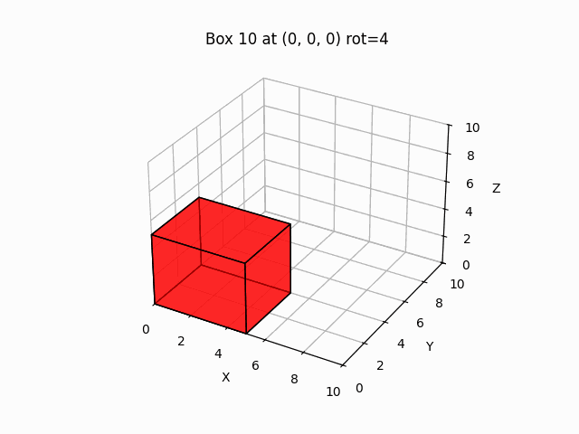

# 3D Bin Packing

A research project for the 3D Bin Packing Problem using **Reinforcement Learning**.  
It includes a custom Gym environment, DQN/PPO agents, a heuristic baseline, and 3D visualizations (with GIF export).



## Features
- Custom `gym.Env` for 3D bin packing (`src/environment/packing_env.py`).
- Two RL agents: **DQN** and **PPO** (`src/agents/`).
- Heuristic baseline (bottom-left-back) for comparison (`src/heuristics/heuristic.py`).
- Training/evaluation utilities and fixed test sets (`src/train/`, `src/evals/`, `src/utils/testsets.py`).
- 3D visualization and GIF generation (`src/utils/visualization.py`).

## Observation Space
The **state representation** encodes the environment at each step:
- **Bin state:** Occupancy grid / 3D representation of already placed boxes.
- **Next box features:** Dimensions (w, h, d) and orientation.
- **Packing statistics:** Remaining space, number of boxes placed, total volume used, etc.

This provides the agent with both spatial and sequential context to decide where to place the next box.

## Reward Shaping
The reward function is crucial for guiding the agent:
- **Positive reward** for successfully placing a box in the bin without overlap.  
- **Volume-based reward:** Proportional to the filled volume fraction (encourages tighter packing).  
- **Penalty** for invalid placements or leaving too much unused space.  
- **Episode reward:** Cumulative sum reflects how efficiently the agent packed all boxes.

Reward shaping is designed to balance exploration (trying placements) and exploitation (maximizing packing efficiency).

## Project Structure
```
src/
  agents/              # DQN & PPO agents
  environment/         # Bin, Box, and PackingEnv (gym.Env)
  evals/               # Evaluation helpers (agents & heuristic)
  heuristics/          # Heuristic baseline(s)
  train/               # Training loops for DQN & PPO
  utils/               # Action space, box generation, seeding, viz, test sets
  main.py              # End-to-end script: train + evaluate + visualize
runs/                  # Plots, and generated GIFs (outputs)
  dqn/
    models/            # Saved dqn agents
  ppo/
    models/            # Saved ppo agents
requirements.txt
Makefile
```

## Requirements
```
pip install -r requirements.txt
```

---

## Quick Start
### 🚀 Full Pipeline

To train, evaluate, and visualize everything in one go:

```bash
make all
```

This will:
- Create the virtual environment and installs the required packages from `requirements.txt`.
- Train the RL agent (default: PPO).
- Evaluate it against fixed test sets and the heuristic baseline.
- Generate visualizations and logs.

You can also customize the run using arguments (see below).
### 🐍 Virtual Environment
This section explains how to create and activate the virtual environment and installs the required packages from `requirements.txt`, just use the command line:

```bash
make setup
```

### 🧠 Training
Train an RL agent (DQN or PPO) on the 3D Bin Packing environment:

```bash
make train
```

You can override defaults by passing variables on the command line:

| Arg        | Purpose                                   | Default | Examples |
|------------|-------------------------------------------|---------|----------|
| `AGENT`    | Which agent to train (`dqn` or `ppo`)     | `ppo`   | `AGENT=ppo` |
| `EPISODES` | Number of training episodes               | `200`   | `EPISODES=5000` |
| `BOXES`    | Number of boxes per episode               | `50`    | `BOXES=100` |
| `SEED`     | Random seed                               | `41`    | `SEED=123` |

Examples:
```bash
# Train PPO for longer
make train AGENT=ppo EPISODES=5000

# Train DQN with more boxes and a fixed seed
make train AGENT=dqn BOXES=80 SEED=7
```

Artifacts (per agent) are stored under `runs/<agent>/` (models, plots, GIFs).

---

### 📊 Evaluation
Evaluate a saved model against fixed test sets and the heuristic baseline:

```bash
make evaluate
```

You can target a specific checkpoint and adjust evaluation settings:

| Arg        | Purpose                                            | Default         | Examples |
|------------|----------------------------------------------------|-----------------|----------|
| `AGENT`    | Which agent’s directory/model to use               | `dqn`           | `AGENT=ppo` |
| `MODEL`    | Path to a specific checkpoint to evaluate          | *(best/latest)* | `MODEL=runs/ppo/dqn_best.pt` |
| `TESTS`    | Number of evaluation episodes (test cases)         | `41`            | `TESTS=50` |
| `BOXES`    | Number of boxes per evaluation episode             | `50`            | `BOXES=100` |
| `SEED`     | Random seed for evaluation                         | `41`            | `SEED=123` |

Examples:
```bash
# Evaluate the latest PPO checkpoint on 50 tests
make evaluate AGENT=ppo TESTS=50

# Evaluate a specific model file with more boxes
make evaluate AGENT=dqn MODEL=runs/dqn/dqn_best.pt BOXES=80
```

By default, evaluation generates plots and 3D packing GIFs in `runs/<agent>/`.

---

### 📈 Experiment Tracking (MLflow)
This project uses **MLflow** to track training performance and version models.

**How to Launch the Dashboard**

To view training curves and logged artifacts, run the following command:
```bash
make mlflow PORT=5000
```
This will start the MLflow server at **http://127.0.0.1:5000** by default.

What is Logged?
Every time you run make train, a new experiment run is created logging:

**Metrics**:
- `volume_utilization`: % of bin volume filled.
- `boxes_placed`: Number of boxes successfully packed.
- `epsilon` (if DQN): Exploration rate decay.
- `avg_reward_100`: Moving average of the last 100 episodes.

**Artifacts**:
- Model Checkpoints: The final trained model is saved as an MLflow artifact.

---
