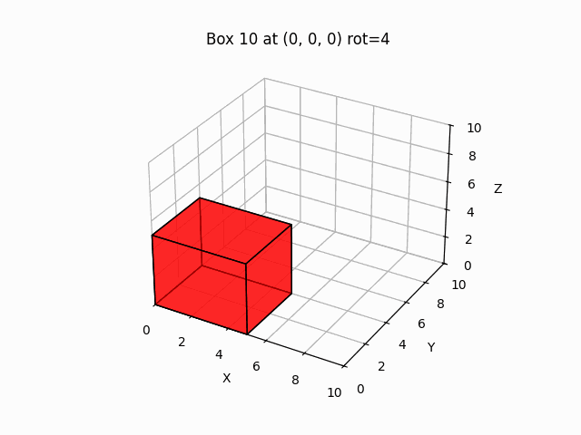

# 3D Bin Packing

A production-grade Deep Reinforcement Learning project that solves the 3D Bin Packing Problem. It implements **DQN** and **PPO** agents within a custom Gym environment, complete with heuristic baselines, 3D visualizations, and a production-ready API for recursive packing.

This project demonstrates a complete MLOps lifecycle: from training agents using PyTorch and tracking experiments with **MLflow**, to versioning artifacts with **DVC** and deploying a **FastAPI** inference service via **Docker**.

<p align="center">
    
</p>

## 📂 Project Structure
```
├── .github/                 # CI/CD configuration
├── .dvc/                    # DVC Configuration
├── src/
│   ├── agents/              # DQN & PPO Agent implementations
│   ├── environment/         # Gym Env, Bin, and Box logic
│   ├── evals/               # Evaluation scripts (Agent vs Heuristic)
│   ├── heuristics/          # BLB Heuristic implementation
│   ├── train/               # Training loops
│   ├── utils/               # Visualization, Action Space, Box Generator
│   ├── api.py               # FastAPI inference endpoints
│   └── main.py              # CLI Entrypoint
├── tests/                   # Unit and Integration tests
├── docker-compose.yml       # Docker services configuration
├── Dockerfile               # Docker image definition
├── Makefile                 # Command automation
├── requirements.txt         # Python dependencies
└── README.md                # Project documentation
```

## 🛠️ Setup & Requirements

This project uses `make` for automation and `dvc` for data/artifact management.

---

## Quick Start
### 🚀 Full Pipeline

To train, evaluate, and visualize everything in one go:

```bash
make all
```

This will:
- Create the virtual environment and installs the required packages from `requirements.txt`.
- Train the RL agent (default: PPO).
- Evaluate it against fixed test sets and the heuristic baseline.
- Generate visualizations and logs.

You can also customize the run using arguments (see below).
### 🐍 Virtual Environment
This section explains how to create and activate the virtual environment and installs the required packages from `requirements.txt`, just use the command line:

```bash
make setup
```

### 🧠 Training
Train a RL agent (DQN or PPO) on the 3D Bin Packing environment:

```bash
make train
```

You can override defaults by passing variables on the command line:

| Arg        | Purpose                                   | Default | Examples |
|------------|-------------------------------------------|---------|----------|
| `AGENT`    | Which agent to train (`dqn` or `ppo`)     | `ppo`   | `AGENT=ppo` |
| `EPISODES` | Number of training episodes               | `200`   | `EPISODES=5000` |
| `BOXES`    | Number of boxes per episode               | `50`    | `BOXES=100` |
| `SEED`     | Random seed                               | `41`    | `SEED=123` |

Examples:
```bash
# Train PPO for longer
make train AGENT=ppo EPISODES=5000

# Train DQN with more boxes and a fixed seed
make train AGENT=dqn BOXES=80 SEED=7
```

Artifacts (per agent) are stored under `runs/<agent>/` (models, plots, GIFs).

---

### 📊 Evaluation
Evaluate a saved model against fixed test sets and the heuristic baseline:

```bash
make evaluate
```

You can target a specific checkpoint and adjust evaluation settings:

| Arg        | Purpose                                            | Default         | Examples |
|------------|----------------------------------------------------|-----------------|----------|
| `AGENT`    | Which agent’s directory/model to use               | `ppo`           | `AGENT=ppo` |
| `MODEL`    | Path to a specific checkpoint to evaluate          | *(best/latest)* | `MODEL=runs/ppo/ppo_best.pt` |
| `TESTS`    | Number of evaluation episodes (test cases)         | `20`            | `TESTS=50` |
| `BOXES`    | Number of boxes per evaluation episode             | `50`            | `BOXES=100` |
| `SEED`     | Random seed for evaluation                         | `41`            | `SEED=123` |

Examples:
```bash
# Evaluate the latest PPO checkpoint on 50 tests
make evaluate AGENT=ppo TESTS=50

# Evaluate a specific model file with more boxes
make evaluate AGENT=dqn MODEL=runs/dqn/dqn_best.pt BOXES=80
```

By default, evaluation generates plots and 3D packing GIFs in `runs/<agent>/`.

---

### 📈 Experiment Tracking (MLflow)
This project uses **MLflow** to track training performance and version models.

**How to Launch the Dashboard**

To view training curves and logged artifacts, run the following command:
```bash
make mlflow PORT=5000
```
This will start the MLflow server at **http://127.0.0.1:5000** by default.

What is Logged?
Every time you run `make train`, a new experiment run is created logging:

**Metrics**:
- `volume_utilization`: % of bin volume filled.
- `boxes_placed`: Number of boxes successfully packed.
- `epsilon` (if DQN): Exploration rate decay.
- `avg_reward_100`: Moving average of the last 100 episodes.

**Artifacts**:
- Model Checkpoints: The final trained model is saved as an MLflow artifact.

---
