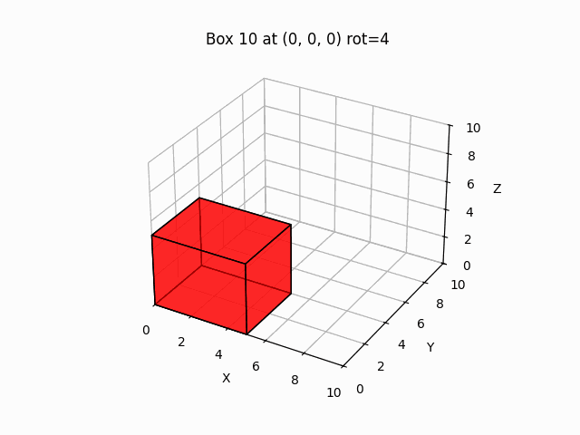

# 3D Bin Packing


A production-grade Deep Reinforcement Learning project that solves the 3D Bin Packing Problem. It implements **DQN** and **PPO** agents within a custom Gym environment, complete with heuristic baselines and 3D visualizations.

This project demonstrates a complete MLOps lifecycle: from training agents using PyTorch and tracking experiments with **MLflow** to versioning artifacts with **DVC**.

<p align="center">
    
</p>

## 📂 Project Structure
```
├── .github/                 # CI/CD configuration
├── .dvc/                    # DVC Configuration
├── src/
│   ├── agents/              # DQN & PPO Agent implementations
│   ├── environment/         # Gym Env, Bin, and Box logic
│   ├── evals/               # Evaluation scripts (Agent vs Heuristic)
│   ├── heuristics/          # BLB Heuristic implementation
│   ├── train/               # Training loops
│   ├── utils/               # Visualization, Action Space, Box Generator
│   └── main.py              # CLI Entrypoint
├── tests/                   # Unit and Integration tests
├── docker-compose.yml       # Docker services configuration
├── Dockerfile               # Docker image definition
├── Makefile                 # Command automation
├── requirements.txt         # Python dependencies
└── README.md                # Project documentation
```

## 🛠️ Setup & Requirements

This project uses `make` for automation and `dvc` for data/artifact management.

1. **Clone the repository**
```bash
git clone https://github.com/alvaro-frank/3d-bpp.git
cd 3d-bpp
```

2. **Setup Environment**: This command creates a virtual environment, installs dependencies, and pulls data via DVC.
```bash
make setup
```

## ⚡ Quick Start

To run the **full end-to-end pipeline** (Setup -> Pull Data -> Test -> Train -> Evaluate) in one go:
```bash
make all
```

## 🏃 Usage

You can run individual steps using the `Makefile` shortcuts.

1. **Training**

Train an RL agent (DQN or PPO) on the 3D environment. Metrics and models are logged to MLflow.

```
# Default training (PPO, 200 episodes)
make train

# Train DQN with specific parameters
make train AGENT=dqn EPISODES=1000 BOXES=30
```

You can override defaults by passing variables on the command line:

| Arg        | Purpose                                   | Default | Examples |
|------------|-------------------------------------------|---------|----------|
| `AGENT`    | Which agent to train (`dqn` or `ppo`)     | `ppo`   | `AGENT=dqn` |
| `EPISODES` | Number of training episodes               | `200`   | `EPISODES=1000` |
| `BOXES`    | Number of boxes per episode              | `15`    | `BOXES=30` |
| `SEED`     | Random seed                            | `41`    | `SEED=123` |
| `MODEL`     | Path to checkpoint to resume training                          | ``    | `MODEL=runs/ppo/ppo_latest.pt` |

2. **Evaluation**

Evaluate a trained model against the Heuristic baseline on fixed test sets. This generates utilization metrics and 3D GIFs.
```
# Evaluate the best PPO model
make evaluate

# Evaluate a specific DQN checkpoint and generate GIFs
make evaluate AGENT=dqn MODEL=runs/dqn/dqn_best.pt --gifs
```

You can override defaults by passing variables on the command line:

| Arg        | Purpose                                   | Default | Examples |
|------------|-------------------------------------------|---------|----------|
| `AGENT`    | Which agent to load (`dqn` or `ppo`)      | `ppo`   | `AGENT=dqn` |
| `MODEL` | Specific checkpoint path (Auto-finds if empty)              | `runs/ppo/ppo_latest.pt`   | `MODEL=runs/dqn/dqn_best.pt` |
| `BOXES`    | Number of boxes per episode              | `15`    | `BOXES=30` |
| `TESTS`     | Number of evaluation episodes                            | `20`    | `SEED=50` |

3. **Unit Testing**

Ensure preprocessing logic (negation handling, tokenization) and model architecture are valid.
```bash
make pytest
```

4. **Experiment Tracking**

Launch the MLflow dashboard to visualize the model metrics and learning curves.
```bash
make mlflow
```

## 🧠 Methodology

**Observation Space**

The environment provides a structured state representation to help the agent make spatial decisions:

1. **Heightmap**: A 2D grid representing the current top-most point of the bin at every (x, y) coordinate, normalized by the bin height. This allows the agent to "see" the surface topology.
2. **Upcoming Boxes**: A lookahead buffer containing the dimensions (width, depth, height) of the next _N_ boxes to be placed.
3. **Global Statistics**: High-level features including the percentage of boxes remaining, current volume utilization, and the maximum height used so far.

**Reward Shaping**

To encourage dense and stable packing, the reward function is composed of several weighted components:

1. **Volume Reward (+)**: Proportional to the volume of the placed box relative to the total volume (incentivizes packing larger items).
2. **Compactness (+)**: A bonus based on the change in the bounding box density (incentivizes keeping the packing "tight").
3. **Contact Area (+)**: Rewards maximizing the surface area contact between the new box and existing boxes/walls (incentivizes stability).
4. **Height Penalty (-)**: A penalty for placements that significantly increase the maximum stack height.
5. **Terminal Bonus (+)**: A large bonus is awarded at the end of the episode if 100% of items are packed, with smaller bonuses for >80% and >90%.

## 🐳 Docker Support

This project is fully containerized to facilitate reproduction and GPU use. The environment is configured for training and evaluation workloads.

**Prerequisites**
- **Docker** and **Docker Compose** installed.

**How to Run**
1. **Build and Start the Environment**: The command below builds the `3d-bpp-trainer:v1` image and starts the container in the background, keeping it alive for executing commands.
```bash
docker-compose up --build
```

2. **Pull Data**: To download the versioned data using DVC inside the container.
```bash
docker-compose run --rm sentiment-app dvc pull
```

3. **Run Training inside Docker**: You can execute the training pipeline within the isolated container.
```
docker-compose run --rm bpp-trainer python src/main.py train --agent ppo --episodes 100
```

4. **Evaluate**: You can run the evaluation script within the isolated container.
```bash
# Evaluate the Model
docker-compose run --rm bpp-trainer python src/evaluate_agent.py --agent ppo --tests 30 --boxes 20
```

5. **Interactive Shell**: To access the terminal inside the container.
```bash
docker-compose run --rm --entrypoint bash sentiment-app
```

## ⚙️ CI/CD Pipeline

This project implements a Continuous Integration pipeline via GitHub Actions.

**Pipeline Workflow:**

1. **Environment**: Sets up Python 3.10 and caches pip dependencies.
2. **Linting**: Enforces code quality using flake8.
3. **Data Sync**: Configures DVC remote (DagsHub) using secrets to pull required artifacts.
4. **Automated Testing**: Executes the full test suite via `pytest`, covering:
     - **Unit Tests**: Validating feature engineering logic and environment core logic.
     - **Integration Tests**: Verifying the reliability of the FastAPI endpoints.
  
**Required GitHub Secrets**

To enable the pipeline in your own fork, you must add the following secrets in your repository settings:
- **`DAGSHUB_USERNAME`**: Your DagsHub username.
- **`DAGSHUB_TOKEN`**: Your DagsHub access token.
